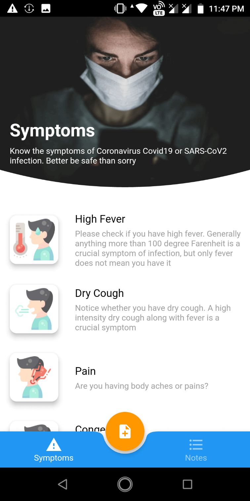
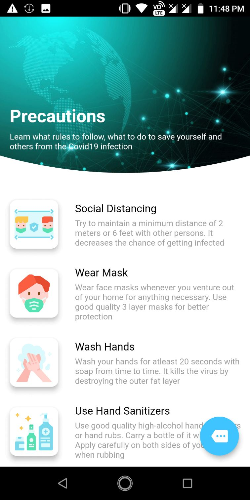

# coronashak

An experimental flutter application to get updated Coronavirus Covid19 data from the Postman Covid19 api. The main intention was to learn Flutter.

## Target
 - To learn Flutter
 - To make an app to cover most of the basic things like widgets, api calls, list and grid views, drawer, bottomsheet etc.
 - To learn how to work with camera, bluetooth and local database
 
 ## Screenshots
 

  
  
  

 

  
  
  

 

  
  
  

 
 

  
  
  

  
  
  

  
  

 
 ## Future Plans
 Implement and test some more features like bluetooth connectivity, image capture using camera(Done), offline storage(Done) and map integration.
